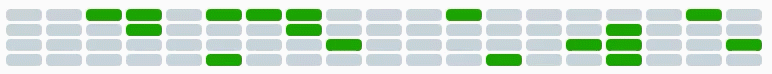
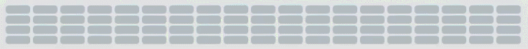
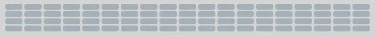
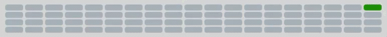

[](https://www.paypal.com/cgi-bin/webscr?cmd=_s-xclick&hosted_button_id=35WE5NU48AUMA&source=url)

BlockMatrix
============
Some simple and cool looking ProgressBar and WaitAnimation.

### Wait Animation



### Random



### Straight



### Bars


### Bars right to left




### Features
- Custom Blocksize
- Custom colors
- Different fillstyles
- Custom matrix size

### Usage (C#)
(WaitAnimation)

```
BlockMatrix matrix = new BlockMatrix(ref <YourGrid x:Name>);
matrix.CreateMatrix();
matrix.Start();
```

(ProgressBar)

```
BlockMatrixProgress matrix = new BlockMatrixProgress(ref <YourGrid x:Name>) { Fillstyle = BlockMatrixProgress.FillStyles.<SelectYourStyle> };
matrix.CreateMatrix();
matrix.Value = 0; // Set value
```

### Enjoying this?
Just star the repo or make a donation.

[](https://www.paypal.com/cgi-bin/webscr?cmd=_s-xclick&hosted_button_id=35WE5NU48AUMA&source=url)

Your help is valuable since this is a hobby project for all of us: we do development during out-of-office hours.

### Contribution
Pull requests are very welcome.

### Copyright
This version was written by **Markus Karl Wackermann**
