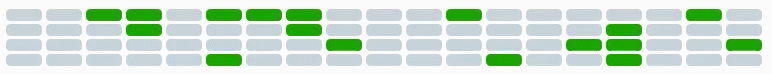
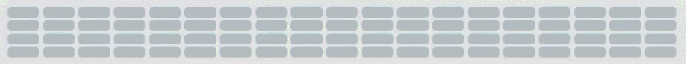
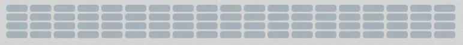
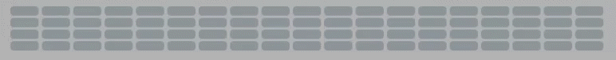
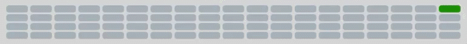

# BlockMatrix

[](https://buymeacoffee.com/spreed)

## Overview

Some simple and cool looking ProgressBar and WaitAnimation.

### Wait Animation



### Random



### Straight



### Bars



### Bars right to left




### Features
- Custom Blocksize
- Custom colors
- Different fillstyles
- Custom matrix size

### Usage (C#)
(WaitAnimation)

```
BlockMatrix matrix = new BlockMatrix(ref <YourGrid x:Name>);
matrix.CreateMatrix();
matrix.Start();
```

(ProgressBar)

```
BlockMatrixProgress matrix = new BlockMatrixProgress(ref <YourGrid x:Name>) { Fillstyle = BlockMatrixProgress.FillStyles.<SelectYourStyle> };
matrix.CreateMatrix();
matrix.Value = 0; // Set value
```

## Contributing
Contributions are welcome! Feel free to submit issues or pull requests.

## License
This project is licensed under the [MIT License](LICENSE.txt).

## Acknowledgments
Thanks for checking out Year In Progress! Stay inspired and keep pushing forward!

### Copyright
This version was written by **Dante Wackermann**

[](https://buymeacoffee.com/spreed)